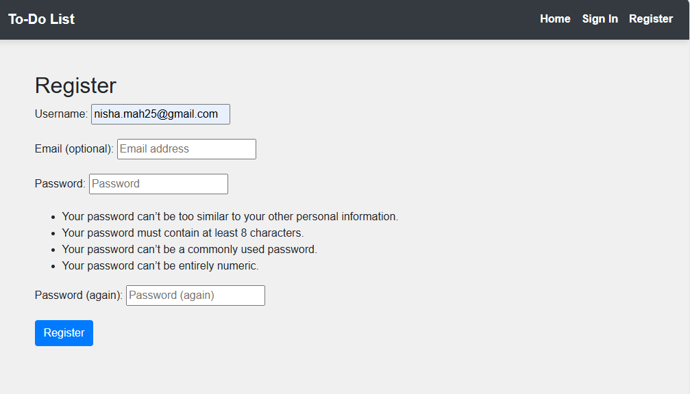

# To-Do-List App

## Welcome to To-Do List App.

View live project here: https://my-todo-list-final-project-45103fba3130.herokuapp.com/

The tool you can rely on to manage your daily tasks and schedules. Create an account, sign in, and start organizing your day by creating, editing, and tracking your tasks effortlessly. With the To-Do List App, staying on top of your to-do list has never been easier!

## Index - Table of Contents

- [User Experience (UX) ](#user-experience-ux)
- [Features](#features)
- [Design](#design)
- [Technologies Used](#technologies-used)
- [Testing](#testing)
- [Deployment](#deployment)
- [Credits](#credits)

## User Experience /User Stories

As a user, I want to:

- See the navigation bar contain clear and descriptive menu items that represent different actions that may be performed my on my page.
- Register with my email and a password, so that I can create a secure account that will store my tasks and keep my data private.
- Create a new to-do task by entering details such as the task title, description, due date, and priority level (low, medium, high), so that I can organize my activities effectively.
- View a list of all my tasks, so I can manage my workload and prioritize my tasks.
- Click to view detailed information of a task including title, description, Date Due, status, Edit buttons and delete buttons.
- Edit an existing task to update its details, such as changing the due date or priority, so that I can adjust to changes and keep my task list accurate.
- Be able to delete a tasks that are no longer needed or have been completed, so that I can keep my task list organized and relevant.
- The To-Do List application to be responsive, adjusting its layout and content to fit the screen size of the device I am using, whether it's a desktop, tablet, or smartphone, ensuring an optimal user experience.
- Experience a consistent layout and design across all pages of the website, including the navigation bar's position, styling, and behavior.

## Features

### Navigation Bar:

- Home: Directs users to the home page to introduce the user to app.
- User Registration and Sign-In Page: Allows users to create an account or sign in if already registered
  

### Task List:

- Comprehensive details of Title, status, priority
- Functional buttons (edit, delete) empowering users to manage Task according to their needs.

### Alert Messages:

- Alert message will pop up to confirm if the user signed in or out . Also when a task is added, edited or delete.

### Login:

- The login page has 2 clear options, username and password.

### Register:

- It offers users space for a First Name, Last Name, username, email(optional), password and then rechecks the password to ensure it matches and there were no errors.
  

### Add Task:

- It asks to complete fields like : Title, Description, Date due and priority
  

### Future Features

Features which could be implemented in the future:

- Task sharing and collaboration.
- Task reminders and notifications.
- Task filtering and catagorization.
- User feedback

## Design

### Wireframe

I used Balsamiq to create my wireframes. These low-fidelity wireframes were created to map out the user interface for the To-Do List application. The design prioritizes simplicity and ease of navigation.

### Home Page

The home page provides a welcoming message at the top, followed by a prominent area dedicated to showcasing the hero image, giving users an immediate visual context of the app’s purpose. The navigation bar at the top ensures users can easily access essential links such as "Home," "Sign In," and "Register."

### Sign-In Page

The sign-in page is straightforward, featuring fields for entering the username and password. The navigation bar remains accessible at the top for easy redirection to other sections, while the form is designed for quick access and ease of use.

### Register Page

The registration page includes fields for the username, email, and password, ensuring a seamless onboarding process for new users. The layout is clean, with a focus on usability, guiding users smoothly through the registration process.

### Agile Development

For the development of To-Do List app, I adopted an Agile methodology to ensure iterative and efficient progress throughout the project lifecycle. Central to this approach was the utilization of a Kanban board hosted on GitHub Projects. You can view the project board [here](https://github.com/users/Mah-N/projects/2/views/1)

#### Kanban Board Overview

I used GitHub project board to develop my site. The project board follows Agile methodology, providing a visual representation of the task management process. The board is updated regularly to reflect the current status of tasks, ensuring that the project progresses smoothly.

- **Todo**: This section contains tasks that are yet to be started.
- **In Progress**: Work in progress was tracked here, indicating tasks actively being worked on
- **Done**: Tasks that were completed successfully were moved to this column.

### Future Featues

**Task reminders and notification, Task filtering, Task catagorization**: These are features that are not essential for the current version but could be implemented in the future based on the project's needs or user feedback. They represent optional enhancements that may improve the user experience or add additional functionality.

**Task Sharing & Collaboration**: Certain features have been designated as "Won't Have" based on current project priorities and constraints. These features are not planned for development and will only be reconsidered if project goals and resources change significantly.

## Technologies Stack

  - HTML5- for page structure
  - CSS3- for custom styling
  - Python- for the backend
  - Django- framework used to build this project
  - Postgres Database- used as the database
  - Google Fonts- for custom font styling
  - Heroku - for hosting and deployement of this project
  - Cloudinary - hosting the static files
  - Pexels - for free stock images
  - Git - for version control.
  - GitHub is used for setting up and managing project repositories.
  - A GitHub Project Board are utilized for effectively managing tasks, tracking project progress, and ensuring efficient implementation.
  - Balsamiq is used for designing wireframes to visualize project layouts.
  - Bootstrap and custom CSS are used to create visually appealing and responsive website, customized to meet specific project needs.

## Testing and Validation

### Responsiveness

I used the dev tools on chrome to test the website for responsiveness. I captured screenshots to demonstrate responsive design across mobile, tablet and laptop based on the size configurations preset in dev tools.

### Home Page

- Laptop
  

- Tablet

- Mobile

- I used the [W3 HTML Validator](https://validator.w3.org/) to check the HTML on each of my site pages.

- I used the [W3 CSS Validator](https://jigsaw.w3.org/css-validator/) to check my CSS script by Direct Input. I found no errors! There are 4 warnigns which are just flagging vendor extensions.

  

- I used the [CI Python Linter](https://pep8ci.herokuapp.com/) to check all my python scripts. I found few errors like the below - mostly lines were too long or there was a missing blank space line. I have left some of the error messages as they are related to a too long line at the result of a comment.

## Manual Testing Results

### Home Page

| Test                                  | Result |
| ------------------------------------- | ------ |
| Home:                                 | Pass   |
| Sign In: It redirect to sign In page  | Pass   |
| Register:It redirect to register page | Pass   |

### Task List Page

| Test                                             | Pass |
| ------------------------------------------------ | ---- |
| To access this required login                    | Pass |
| Add Task: It redirects to add task page          | Pass |
| View Task: It redirects to view page             | Pass |
| Edit Task: It redirects to edit the task         | Pass |
| Delete Task: It redirects to confirm delete page | Pass |

### Login Page

| Test                            | Result |
| ------------------------------- | ------ |
| Secure signup functionality     | Pass   |
| Redirect after successful login | Pass   |

### Registration Page

| Test                                   | Result |
| -------------------------------------- | ------ |
| Secure login functionality             | Pass   |
| Redirect after successful registration | Pass   |

### Logout Page

| Test                             | Result |
| -------------------------------- | ------ |
| Logout functionality             | Pass   |
| Redirect after successful logout | Pass   |

### Security

| Test                                                         | Result |
| ------------------------------------------------------------ | ------ |
| Prevention of brute force actions via URL                    | Pass   |
| Redirect to sign-in page after attempted unauthorized action | Pass   |

## Deployment

To deploy the To-Do List application to Heroku the following steps were taken:

1.  **Create a New Repository**:

    - Set up a new repository.

2.  **Set up the Development Environment**:

    - Copy the repository URL into your development environment (e.g., Gitpod).
    - Install Django and ensure it’s listed in the requirements.txt file.

3.  **Prepare for Deployment**:
    - Create a `Procfile` in your project directory to specify the web server (e.g., `gunicorn`).
    - Ensure all necessary dependencies are included in the `requirements.txt`.
4.  **Create a Heroku App**:

    - Log in to Heroku and create a new application.
    - Name your application and select a region.

5.  **Connect to GitHub**:
    - In Heroku, connect your application to the relevant GitHub repository.
6.  **Configure Environment Variables**:
    - In the Heroku app settings, add any necessary environment variables, such as the database URL.
7.  **Deploy the Applications**:
    - Deploy the application by clicking on 'Deploy Branch' to manually deploy.
8.  **Launch the Application**:
    - After deployment launch the app directly from the Heroku dashboard.

[Back to Top](#to-do-list-app)

## Chrome Browser Alert Issue

Please note that the deployed project link is currently being flagged as a dangerous site in Google Chrome. This appears to be a false positive triggered by Chrome's security policies, as the site functions perfectly in other browsers like Microsoft Edge, Firefox, etc.

If you encounter the warning shown in the screenshot below, you can safely bypass it by clicking on the highlighted area labeled "Only visit this unsafe site." This will allow you to access the project as intended.

This issue has been reported and should resolve itself in the coming days, as per advice from the tutor assistant. Please be assured that the site is safe and fully operational when accessed through other browsers.

## Credits

- Code Institute LMS
- [Task Manager](https://github.com/enocol/Task-Manager)
- https://github.com/Gordon-Meade/thebearadirectoryblog
- https://github.com/katiejanecoughlan/sojourn-scribbles-V3
- [Hero Image](https://www.pexels.com/photo/woman-in-gray-coat-using-white-laptop-computer-4065891/)
- [Youtube Tutorial](https://www.youtube.com/watch?v=PgDKQqvUn8U&list=PL8Loxdz4U5rqhjG3xAeE5SAmeeJJ5zQY0&index=1)
- [ChatGPT](https://chatgpt.com/)
- [W3 Schools](https://www.w3schools.com/)

[Back to Top](#to-do-list-app)
